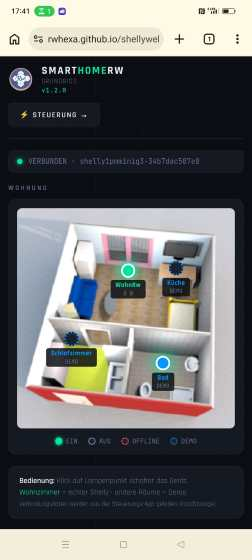

# 🏠 SmartHomeRw

> Browserbasierte Smart-Home-Steuerung für **Shelly Gen3** Geräte über **MQTT** und **HiveMQ Cloud** — mit interaktivem Wohnungs-Grundriss

Eine moderne, plattformübergreifende Web-App zur Fernsteuerung und Überwachung
von Shelly-Smart-Home-Geräten. Zwei Ansichten: klassische Steuerung mit Status-Karten
oder visueller Grundriss mit klickbaren Lampen. **Läuft im Desktop-Browser(Windows)
und auf Android-Browser(Handy) ohne Installation.**

🚀 **Live-Demo:** [rwhexa.github.io/shellyweb/Project1.html](https://rwhexa.github.io/shellyweb/Project1.html)

---

## ✨ Features

### Steuerungs-Seite (`Project1.html`)
- 🔐 **HiveMQ Cloud** Verbindung via WebSocket (WSS, TLS-verschlüsselt)
- 📊 **Live-Messwerte:** Leistung · Spannung · Strom · Verbrauch
- 💡 **Ein/Aus schalten** mit Echtzeit-Statusanzeige
- ➕ **Mehrere Geräte** verwaltbar
- 📑 **Tab-Navigation:** Verbindung / Geräte
- 🐛 **MQTT-Log** zur Diagnose

### Grundriss-Seite (`wohnung.html`)
- 🏠 **Interaktiver Wohnungs-Grundriss** mit 3D-Bild
- 💡 **Klickbare Lampen-Overlays** in den Räumen
- ⚡ **Wohnzimmer-Lampe** schaltet echten Shelly direkt
- 🎨 **3 Demo-Lampen** für andere Räume
- ✅ **Connect-per-Click** Architektur für maximale Zuverlässigkeit
- 📊 **Status-Anzeige** beim Seitenaufruf (EIN/AUS)

### Allgemein
- 📱 **Mobile-ready** – funktioniert auf Android(Handy/Tablet) und iOS Browsern
- 💾 **Persistente Speicherung** (Zugangsdaten + Geräte bleiben erhalten)
- 🎨 **Dark-Theme UI** mit Tab-Navigation und eigenem Logo
- 🔄 **Auto-Refresh** für Status-Updates auf Steuerungs-Seite

---

## 🖥️ Plattformen

| Plattform | Status |
|-----------|:------:|
| Windows Chrome / Edge / Firefox | ✅ |
| macOS Safari / Chrome | ✅ |
| Linux Chrome / Firefox | ✅ |
| Android Chrome | ✅ |
| iOS Safari | ✅ |

---

## 🏗️ Architektur

```
┌─────────────────────────────┐    ┌─────────────────────────────┐
│  Project1.html              │    │  wohnung.html               │
│  (TMS Web Core App)         │←──→│  (eigenständige HTML-Seite) │
│                             │    │                             │
│  - Permanente MQTT-Verb.    │    │  - Connect-per-Click        │
│  - Live Schalten + Status   │    │  - Wohnung-Bild + Lampen    │
│  - Multi-Device Verwaltung  │    │  - Initial-Status beim Load │
└──────────────┬──────────────┘    └──────────────┬──────────────┘
               │                                  │
               └─────────► localStorage ◄─────────┘
                       (Host, User, Pass, Devices)

                              ↕ WSS Port 8884

                    ┌─────────────────────┐
                    │  HiveMQ Cloud       │
                    │  MQTT Broker (TLS)  │
                    └──────────┬──────────┘
                               │
                               ↕ MQTT Port 8883
                    ┌─────────────────────┐
                    │  Shelly 1PM Mini    │
                    │  Gen3               │
                    └─────────────────────┘
```

### Zwei verschiedene Verbindungsstrategien

**Steuerungs-Seite (Project1.html):**
Permanente MQTT-Verbindung für Live-Updates und sofortiges Schalten mehrerer Geräte.

**Grundriss-Seite (wohnung.html):**
"Connect-per-Click" – bei jedem Klick wird eine neue Verbindung aufgebaut, der
Befehl gesendet und sofort wieder getrennt. Das macht das Schalten **garantiert
zuverlässig** auch nach längerer Idle-Zeit.

---

## 📂 Projektstruktur

| Datei | Zweck | Quelle |
|-------|-------|--------|
| `Project1.dpr` | Delphi Projekt-Hauptdatei | Delphi |
| `Unit1.pas` | Hauptformular, MQTT-Logik, localStorage | Delphi |
| `Unit1.dfm` | Formular-Layout (Auto-Refresh Timer) | Delphi |
| `Unit1.html` | Frontend mit Tab-Nav + Grundriss-Link | Delphi Build |
| `Project1.html` | TMS-Template (Einstiegspunkt) | Delphi Build |
| `ShellyController.js` | Kompilierter Pascal-Code | Delphi Build |
| `MQTTBridge.pas` | Wrapper um MQTT.js | Delphi |
| `ShellyDevice.pas` | Shelly Gen3 Geräte-Logik | Delphi |
| `wohnung.html` | Eigenständige Grundriss-Seite | Manuell |
| `grundriss.png` | Wohnung 3D-Bild | Manuell |
| `logorw.png` | Logo (Rw) | Manuell |

---

## 🚀 Schnellstart

### Live-Version nutzen

Einfach im Browser öffnen:

**[https://rwhexa.github.io/shellyweb/Project1.html](https://rwhexa.github.io/shellyweb/Project1.html)**

1. Tab **VERBINDUNG** → HiveMQ-Zugangsdaten eintragen
2. **VERBINDEN** klicken
3. Tab **GERÄTE** → Shelly Device-ID hinzufügen
4. Status erscheint sofort, schalten und überwachen
5. Im Header oben rechts auf **🏠 Grundriss** klicken
6. Wohnung-Bild mit klickbaren Lampen erscheint
7. Wohnzimmer-Lampe klicken → echter Shelly schaltet (~1-2 Sek)

> 💡 Zugangsdaten und Geräte werden im Browser gespeichert (localStorage) –
> beim nächsten Aufruf ist alles vorausgefüllt.

### Selber kompilieren

**Voraussetzungen:**
- Delphi 12.1 (RAD Studio)
- TMS Web Core v2.4.6.1 oder neuer

**Schritte:**
1. Repository klonen: `git clone https://github.com/rwhexa/shellyweb.git`
2. `ShellyController.dproj` in Delphi öffnen
3. **Project → Clean → Build All**
4. Output liegt in `TMSWeb\Debug\`
5. Folgende manuelle Dateien dazukopieren in `TMSWeb\Debug\`:
   - `wohnung.html`
   - `grundriss.png`
   - `logorw.png`
6. Lokal testen:
   ```bash
   cd TMSWeb\Debug
   python -m http.server 8000
   ```
   → `http://localhost:8000/Project1.html`

---

## ⚙️ HiveMQ Cloud konfigurieren

1. Account anlegen auf [hivemq.cloud](https://www.hivemq.cloud/) (kostenlos)
2. Cluster erstellen → Hostname, Benutzer, Passwort notieren
3. **Wichtig:** Im Cluster den **WebSocket Listener (Port 8884)** aktivieren
4. Im Shelly-Gerät MQTT auf den HiveMQ-Server konfigurieren (Port 8883, TLS)

---

## 📝 Wichtige Hinweise

⚠️ **Device-IDs immer kleinschreiben!**
MQTT-Topics sind case-sensitive. Eine Device-ID wie
`Shelly1pmminig3-...` mit großem `S` führt dazu, dass keine Status-Nachrichten ankommen.
Auf Mobilgeräten besonders aufpassen, da Auto-Korrektur den ersten Buchstaben
gerne automatisch großschreibt.

✅ **Korrekt:** `shelly1pmminig3-34b7dac507e0`

⚡ **Seitenwechsel zwischen Steuerung und Grundriss:**
Beim Wechsel wird die MQTT-Verbindung neu aufgebaut (~1-2 Sekunden) – technisch
bedingt durch Browser-Seitenwechsel. Da Zugangsdaten und Geräte im localStorage
gespeichert sind, geschieht das automatisch.

⏱️ **Schaltvorgang auf Grundriss-Seite:**
Dauert ~1-2 Sekunden, da bei jedem Klick eine frische MQTT-Verbindung aufgebaut wird.
Das ist gewollt für maximale Zuverlässigkeit (siehe Lessons Learned).

---

## 🎨 Grundriss anpassen

Die Lampen-Positionen auf dem Grundriss sind als Prozentangaben in `wohnung.html`
definiert:

```html
<div class="lamp" id="lampWohnzimmer" style="left:51%;top:33%">
```

Anpassen für eigene Wohnung: `left` und `top` ändern.
Eigenes Wohnungs-Bild: `grundriss.png` ersetzen (empfohlene Breite: 800px).

---

## 💡 Lessons Learned

Während der Entwicklung mussten einige technische Hürden gemeistert werden.
Diese Erkenntnisse können auch für andere MQTT/Browser-Projekte hilfreich sein:

### MQTT.js auf HiveMQ Cloud Free Tier
- **Permanente Verbindungen** sind über lange Idle-Zeiten unzuverlässig
- **`mqttClient.connected`** kann `true` zeigen obwohl Verbindung tot ist
- **Connect-per-Click** ist die robusteste Lösung für gelegentliches Schalten
- Mehrere parallele Verbindungen vom selben User können konkurrieren

### Browser-Sicherheit
- `file://` URLs blockieren WebSockets in Chrome → lokal Webserver nötig
- localStorage ist pro Origin geteilt → funktioniert auch über mehrere HTML-Seiten
- Public Repository auf GitHub Pages → keine sensiblen Daten im Code

### TMS Web Core Eigenheiten
- `$(ProjectName).js` Platzhalter funktioniert nur beim Build, nicht beim Laden
- Pascal-Property-Namen werden als Felder kompiliert (`Name` → `FName`)
- Form-Layout passt nicht ideal zu großen Bildern → separate HTML-Seiten als Lösung
- Pascal-Variablennamen sollten nicht mit JS-Globals kollidieren (`JSON`, `Date`, etc.)

Vollständige Bug-Diagnose und Lösungswege siehe [CHANGELOG.md](CHANGELOG.md).

---

## 🛠️ Technologie-Stack

- **Frontend-Framework:** [TMS Web Core](https://www.tmssoftware.com/site/tmswebcore.asp) (Steuerungs-Seite)
- **Pure HTML/JavaScript** (Grundriss-Seite)
- **Sprache:** Object Pascal (kompiliert zu JavaScript via pas2js)
- **MQTT-Library:** [MQTT.js](https://github.com/mqttjs/MQTT.js) (CDN)
- **Broker:** HiveMQ Cloud
- **Hardware:** Shelly 1PM Mini Gen3
- **Hosting:** GitHub Pages
- **Fonts:** Rajdhani (UI), JetBrains Mono (Daten)

---

## 📜 Versionshistorie

Vollständige Versionshistorie siehe [CHANGELOG.md](CHANGELOG.md).

**Aktuell:** v1.3.0 – Connect-per-Click Architektur für die Grundriss-Seite

---

## 🌍 Hosting auf GitHub Pages

Die App wird kostenlos über GitHub Pages gehostet – ohne eigene Domain oder Server.
Detaillierte Anleitung wie das eingerichtet wird siehe [GITHUB-PAGES-DEPLOYMENT.md](GITHUB-PAGES-DEPLOYMENT.md).

---

## 🔗 Repositories

| Repository | URL | Zweck |
|------------|-----|-------|
| [`shelly-controller`](https://github.com/rwhexa/shelly-controller) | https://rwhexa.github.io/shelly-controller/ | Stabile Backup-Version |
| [`shellyweb`](https://github.com/rwhexa/shellyweb) | https://rwhexa.github.io/shellyweb/ | Aktuelle Entwicklungs-Version |

**Backup-Strategie:**
Während in `shellyweb` neue Features entwickelt werden, läuft `shelly-controller`
als unveränderte stabile Version weiter. Falls in `shellyweb` ein Update Probleme
macht, ist die Backup-Version immer verfügbar.

---

## 📄 Lizenz

Privates Projekt – frei zur Nutzung und Anpassung.

---

## 👤 Autor

**RwTec** – Smart Home & IoT Projekte mit Delphi / Lazarus / Free Pascal



